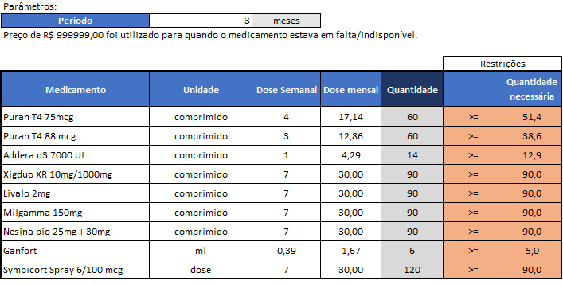
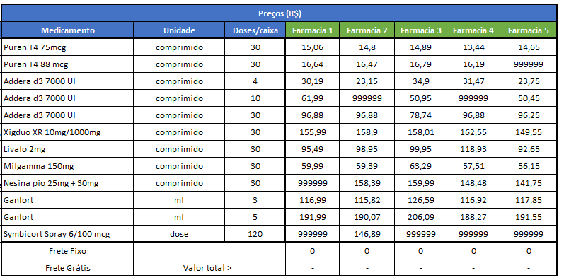
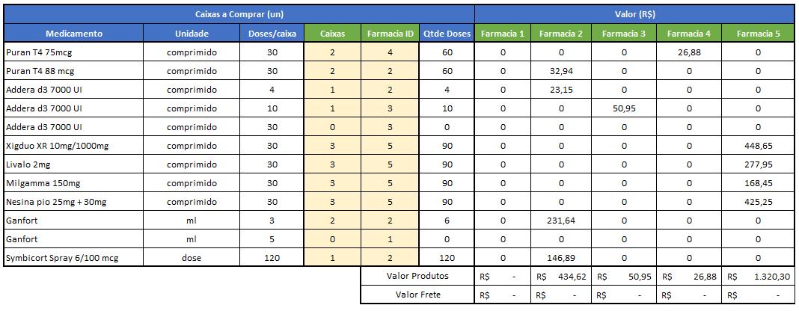
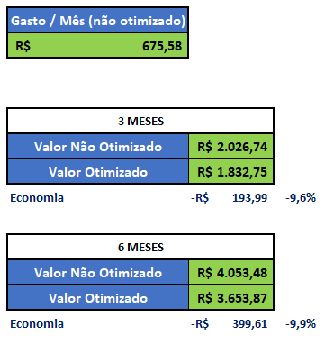

# Otimização de Compra de Medicamentos em Farmácias Online

#### Aluno: [Leticia Bacoccoli](https://github.com/leticiabac)
#### Orientador: [Felipe Borges](https://github.com/FelipeBorgesC)

---

Trabalho apresentado ao curso [BI MASTER](https://ica.puc-rio.ai/bi-master) como pré-requisito para conclusão de curso e obtenção de crédito na disciplina "Projetos de Sistemas Inteligentes de Apoio à Decisão".

- [Link para o código - Parte 1 (Busca Urls)](PROJ_lista_urls_medicamentos.ipynb). 
- [Link para o código - Parte 2 (Coleta de Preços)](PROJ_busca_precos_medicamentos.ipynb).
- [Link para o otimizador - Excel](Otimizador.xlsx).

---

### Resumo

O presente trabalho traz uma proposta de otimzação de planejamento de compra de medicamentos de uso contínuo. A modelagem de otimização teve como insumos os dados de preços, coletados a partir de uma rotina de *web scraping*, e as doses mensais prescritas para uma dada lista de medicamentos. Com estas informações, o planejamento foi otimizado através de algoritmo evolucionário, tendo sido obtidos resultados de até 10% de economia em comparação à situação não otimizada.

### 1. Introdução

Os gastos com compras de medicamentos são parte significativa dos gastos mensais de grande parte da população, principalmente de pessoas que fazem uso de medicamentos de uso contínuo. O objetivo deste trabalho é minimizar o custo de compra deste tipo de medicamentos, coletando automaticamente informações de preços a partir de diversos sites de venda online e otimizando o planejamento de compra para uma quantidade pré-definida de meses. 

A seguir são apresentados detalhes de como foi realizada a modelagem do problema e quais os resultados obtidos.

### 2. Modelagem

O problema foi divido em uma etapa de coleta de preços e outra etapa de modelagem do otimizador em si, conforme apresentado a seguir.

#### 2.1 Coleta de Preços

O primeiro passo da resolução do problema foi realizar uma pesquisa de preços de forma automatizada através da consulta a uma diversos sites de farmácias de venda online. Este passo foi desenvolvido através de rotinas de *web scraping* em Python, conforme descritas abaixo.

 * **[*Busca de URLs*](PROJ_lista_urls_medicamentos.ipynb)** : Rotina que tem como entrada a lista dos medicamentos de interesse e uma lista de sites de farmácias online e utiliza a biblioteca *googlesearch* para listar as URLs correspondentes à página de compra de cada medicamento em cada um dos sites indicados. O resultado dessa rotina é um arquivo .csv contendo a lista de URLs encontradas.
 * **[*Coleta de Preços*](PROJ_busca_precos_medicamentos.ipynb)** : Rotina que tem como entrada a lista de URLs mapeadas na rotina anterior e extrai a informação de preço apresentada em cada uma das páginas. Para o processo de *scraping* foram utilizadas as bibliotecas da ferramenta Selenium Webdriver que permite simular a abertura dos sites em um navegador e então extrair informaçõs a partir da estrutura do HTML da página. O resultado dessa rotina é um arquivo .csv com a lista de preços por site, agrupada por medicamento.

#### 2.2 Otimizador

O modelagem do otimizador foi realizada no *Microsoft Excel* e foi enriquecida com as informações de preços obtidas a partir do processo de Coleta de Preços apresentado anteriormente.

A primeira etapa da modelagem foi a quantificação das doses mensais de cada medicamento de acordo com a prescrição médica. As quantidades totais necessárias foram calculadas considerando o número de meses para os quais se pretende realizar a compra, que foi inserido no modelo como um parâmetro a ser definido pelo usuário. As quantidades totais necessárias foram configuradas como restrições do modelo, conforme apresentado na figura abaixo. 

A lista de preços obtida na etapa de coleta de preços realizada previamente foi utilizada como referência. O custo do frete foi desprezado para todas as farmácias, considerando que a prática de fornecer frete gratuito se mostrou usual para a maioria dos sites.

A modelagem foi criada permitindo a simulação de compra de diferentes quantidades de cada medicamento em diferentes embalagens e diferentes farmácias, calculando, com base nessas quantidades, o custo total da compra. Foi utilizado o algoritmo **Evolutionary** do *Solver* do *Excel* para buscar minimizar o custo total da compra, conforme apresentado abaixo.

### 3. Resultados

Para avaliação dos resultados obtidos, foi elaborada uma simulação de compra numa situação não otimizada, conforme apresentado abaixo.

Os resultados encontrados permitiram uma economia que chegou próxima a 10% para um prazo de 6 meses de planejamento otimizado em comparação à compra mensal não otimizada. 

### 4. Conclusões

Os resultados da otimização permitem ganho financeiro ao propor uma compra de medicamentos otimizada entre diferentes quantidades e sites para o prazo definido. Quanto maior o prazo, maior a possibilidade de se optar por embalagens maiores que atendem às necessidades prescritas com um menor custo aumentando assim o ganho frente à solução não otimizada.

Considerando a volatilidade de preços dos medicamentos, a abordagem do problema através de coleta automatizada de preços possibilita a atualização dos valores no dia  em que se deseja realizar a otimização. Desta forma, a modelagem fica disponível para ser reaproveitada no futuro com a atualização dos preços de referência.

Deve-se ter atenção ao processo de *web scraping* pois o mesmo demanda grande tempo de processamento e é suscetível a alterações e bloqueios por parte dos sites de onde as informações estão sendo coletadas. Uma melhoria futura seria a utilização de APIs específicas para coleta dessas informações, caso disponíveis. (no momento da elaboração deste trabalho não foram localizadas APIs para essa finalidade disponibilizadas pelas farmácias)

---

Matrícula: 192.190.042

Pontifícia Universidade Católica do Rio de Janeiro

Curso de Pós Graduação *Business Intelligence Master*

